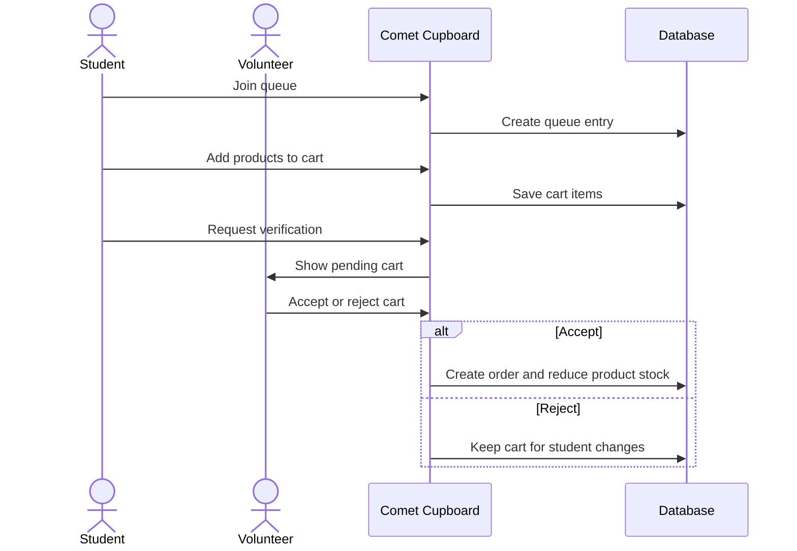
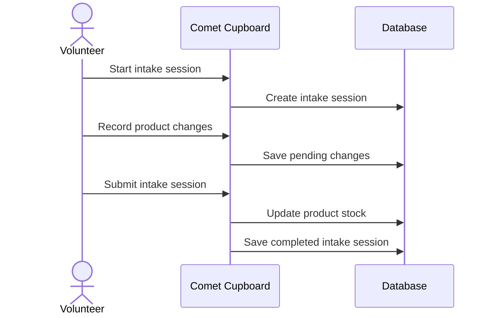

# Comet Cupboard

## Purpose

Comet Cupboard is a pantry system for The University of Texas at Dallas. It manages stock, student shopping, volunteer review, emergency bags, and
administration.

## Roles

All signed-in users authenticate with UTD SSO. The system assigns one role to each user.

| Role       | Main work                                                                                         |
| ---------- | ------------------------------------------------------------------------------------------------- |
| Student    | Join the queue, browse available items, build a cart, and request cart review.                    |
| Volunteer  | Manage inventory intake, review carts, manage the queue, and manage emergency bags.               |
| Admin      | Manage users, categories, sources, locations, tutorials, announcements, and past intake sessions. |
| Head admin | View data analytics and audit logs. Manage custom dashboard links.                                |

## Main Workflows

### Student Shopping

1. The student joins the queue.
2. The student browses available products and adds products to a cart.
3. The student requests cart verification.
4. A volunteer accepts or rejects the cart.
5. When a volunteer accepts the cart, the system creates an order and removes the stock.

### Inventory Intake

1. A volunteer starts an intake session for a source.
2. The volunteer records product quantity changes.
3. The volunteer submits the session.
4. The system updates product stock and saves the completed session.

### Emergency Bags

Volunteers create, edit, duplicate, and move emergency bags. A bag contains selected products, labels, an expiry date, and an optional location. The system
reserves product stock when a bag is created or changed.

Only admins and head admins can create, view, or edit private emergency bags. Private bags include a description. Public users can view public bag counts by
location and can claim a public bag by its bag label.

## Data Model

An `Item` defines a pantry item. A `SpecificItem` defines a product variant, including its product name, image, labels, and quantity. Stock changes apply to
`SpecificItem` records.

The main records are:

- `Category`, `Item`, `SpecificItem`, and `Deal` for inventory.
- `Cart`, `Order`, and `QueueEntry` for student shopping.
- `InventoryIntakeSession` and completed intake records for restocking.
- `EmergencyBag`, bag labels, bag items, and locations for emergency bags.
- `User`, `UserSession`, and `AuditLog` for access and records.

## Technical Design

| Area                    | Technology          |
| ----------------------- | ------------------- |
| Web application and API | Nuxt and TypeScript |
| Database access         | Prisma              |
| Database                | SQLite              |
| Authentication          | UTD SSO             |
| Live updates            | Server-Sent Events  |

The client is in `app/`. API handlers are in `server/api/`. Shared types and permission values are in `shared/`. The Prisma schema is in `prisma/schema.prisma`.
