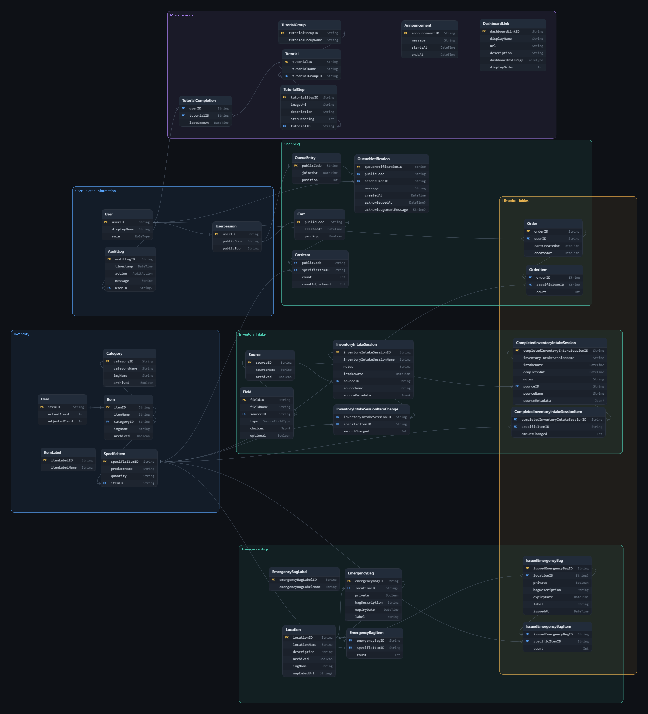

# Comet Cupboard: Inventory Tracking

## Conceptual Overview

The purpose of the Comet Cupboard Inventory Tracking is to

- Provide a streamlined view of the inventory of the food pantry
- Enhance the student and volunteer checkout experience, integrating a seamless flow for students to checkout items, and volunteers to manage the student's carts
- Facilitate add/removal of inventory items through restocking and cart checkout
- Provide analytics for the admin about useful statistics such as Comet Cupboard weekly usage or most popular items in a week

### Users and Workflows

#### User

- Anyone who is able to login through UTD SSO
- Capable of logging in as a student, volunteer, or admin/staff

We need to replace this section with the current roles: student, volunteer, admin, and head admin.

## Technical Implementation

### Tech Stack

- Frontend/Backend - Nuxt.js
- Database - SQLite and Prisma
- Testing - Vitest

### Data Model

### Third Party Integrations

- UTD SSO; Enhances website security by allowing students to sign in via NetID and password
